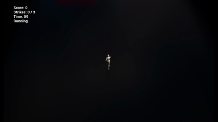

# Signal Sprint - Delegate and Event Understanding




Signal Sprint is a tiny Unreal Engine 5 C++ project designed to **understand delegates and event-driven gameplay architecture**.

The goal is not to build a large or polished game, but to create a **minimal system where gameplay, UI, and feedback are coordinated through delegates instead of tight coupling**.

---

## Gameplay

Signal Sprint is a simple top-down runner. The player moves forward through a series of gates:

- **Success gates** increase score  
- **Failure gates** add strikes  
- The run ends when either:
    - The timer reaches zero
    - The player reaches the strike limit

**Gameplay Loop:**

```
Start Menu → Running → Game Over → Retry (reload level)
```

---

## Controls

| Key         | Action         |
|-------------|---------------|
| WASD        | Steer player  |
| Start Button| Begin run     |
| Restart Button       | Restart run   |

---

## Project Goals

This project explores:

- **Unreal Engine C++ gameplay architecture**
- **Multicast delegates**
- **Event-driven systems**
- **System decoupling**
- **Gameplay state coordination**

Instead of direct references, communication flows through delegates.

---

## Architecture Overview

The project is structured so that **gameplay events propagate outward through listeners**.

### Gate Resolution Flow

```
SignalGate
     ↓ emits
OnGateResolved (multicast delegate)

GateSpawner
     ↓ listens
updates GameState

GameState
     ↓ emits
OnGameStateChanged (multicast delegate)

Listeners react:
- PlayerController → switches menus
- PlayerCharacter → enables/disables movement
- HUDWidget → updates UI
- GateSpawner → enables/disables spawning
```

This creates a **loosely coupled architecture** where systems do not need to know about each other.

---

## Delegate Usage

Several delegate patterns are used in the project.

### Gate Event

Each gate emits an event when triggered:

```cpp
DECLARE_MULTICAST_DELEGATE_OneParam(FSignalGateTriggerDelegate, const FSignalGateResolution&);
```

Listeners include:

- Audio feedback
- Camera feedback
- VFX feedback
- Gate spawner

### Game State Event

The GameState broadcasts changes through `OnGameStateChanged`.

**Payload structure:**

```cpp
FGameStatePayload
{
        Score
        Strikes
        MaxStrikes
        TimeRemaining
        RunState
}
```

This allows multiple systems to react to state changes independently.

---

## Delegate Lifetime Lessons

Key lessons from this project:

1. **Multicast delegates are powerful but require care**  
     They allow multiple systems to react to the same event without coupling.

     **Example flow:**
     - Gate → GameState
     - Gate → Audio
     - Gate → Camera
     - Gate → VFX

2. **Listener cleanup matters**  
     Listeners bound with `AddUObject` should generally remove bindings when long-lived objects shut down (e.g., GameState listeners, UI widgets, PlayerController).  
     Short-lived actors should not aggressively unbind during teardown, as Unreal’s destruction order can cause crashes if a sender is already partially destroyed.

3. **Event payloads simplify interfaces**  
     Passing a structured payload allows systems to evolve without constantly changing delegate signatures.

     **Example payload:**
     ```cpp
     FSignalGateResolution
     {
        Gate
        Player
        Result
        Amount
    }
     ```

---

## Folder Structure

```
Source/SignalSprint/
    Core/
        SignalTypes
    Gameplay/
        SignalGate
        SignalGateSpawner
        SignalSprintGameState
        GateAudioListener
        GateCameraFeedbackListener
        GateVFXListener
    Player/
        SignalSprintPlayerCharacter
    UI/
        SignalSprintHUDWidget
        SignalSprintGameOverWidget
    Controller/
        SignalSprintPlayerController
```

---

## What I Learned

- **Delegates vs direct calls:**  
    Delegates are useful when multiple systems react to the same event or need to remain modular.  
    Direct function calls are simpler for clear one-to-one relationships.

- **Event-driven UI:**  
    Instead of polling values every frame, the HUD reacts to GameState changes through delegates, reducing unnecessary work and simplifying UI logic.

- **Gameplay state as the central authority:**  
    The GameState acts as the single source of truth for score, strikes, run state, and timer.  
    Other systems react to changes rather than modifying each other directly.

---

## Engine Version

**Unreal Engine 5.3**
